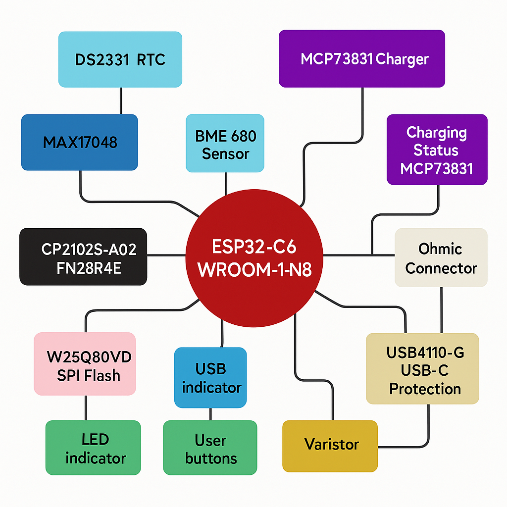
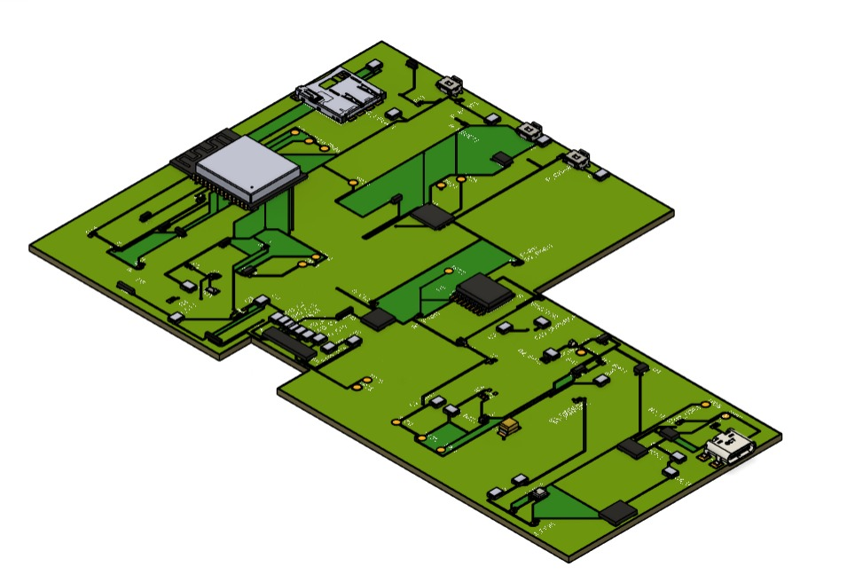
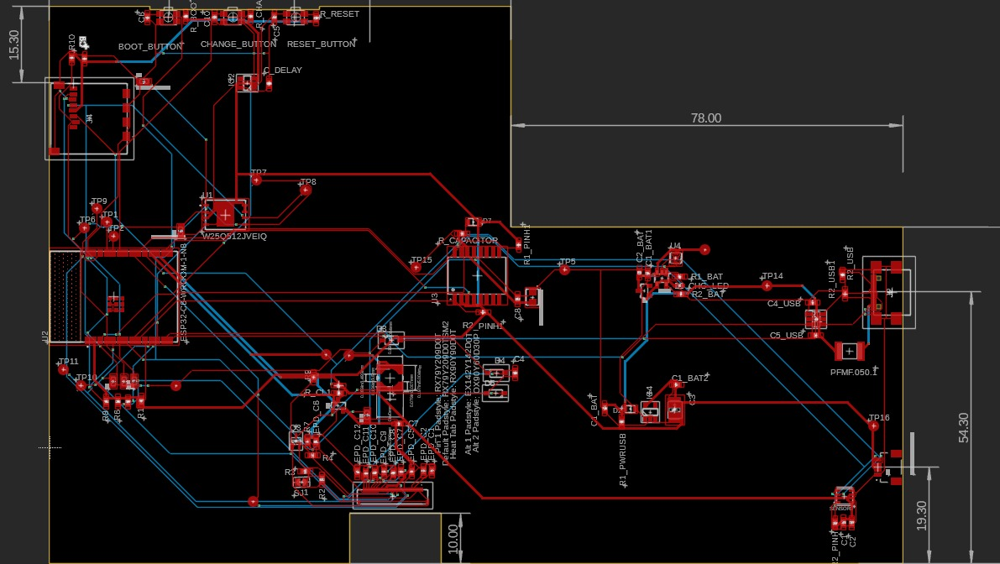

## EBookReader

Am început realizarea proiectului pornind de la schema electrică oferită în enunț. Am adăugat fiecare componentă din biblioteca sugerata și le-am conectat corespunzător, atribuindu-le etichete adecvate. După finalizarea conexiunilor, am rulat o verificare ERC pentru a identifica eventualele erori si am rezolvat marea majoritate. A rămas o singură eroare nerezolvată, deoarece Fusion nu a putut indica locația acesteia. După ce schema a fost finalizată, am trecut la partea de PCB. Am decupat placa conform dimensiunilor cerute folosind masuratorile oferite de Fusion. Cea mai mare provocare a fost identificarea și poziționarea corectă a componentelor pe PGB. După plasare, am realizat rutarea și am validat designul în funcție de regulile specificate în enunț. Pentru a elimina erorile, a fost necesară modificarea footprint-ului pentru anumite piese. În final, am realizat planul de masă atât pentru stratul superior, cât și pentru cel inferior.

---

## Arhitectură Generală a Sistemului

## Descriere Generală

Modulul **ESP32-C6-WROOM-1-N8** este nucleul sistemului, facilitând comunicarea cu toate celelalte periferice prin interfețe standard precum I2C, SPI și GPIO. Alimentarea este realizată printr-o baterie Li-Po, gestionată de un controler de încărcare dedicat și monitorizată constant cu ajutorul unui fuel gauge.

---

## Componente Hardware

###  ESP32-C6
- Microcontroller cu procesor RISC-V
- Conectivitate Wi-Fi 6 și Bluetooth LE
- Interfețe: SPI, I2C, UART, GPIO
- Tensiune de operare: 3.3V

### Componente și resurse

| Componentă  | Link Achiziție | Datasheet |
|-------------|----------------|-----------|
| BOOT_BUTTON | https://ro.mouser.com/ProductDetail/Panasonic/EVQ-P7L01P | https://componentsearchengine.com/Datasheets/2/EVQP7L01P.pdf |
| C1          | https://ro.mouser.com/ProductDetail/YAGEO/CC0402MRX5R5BB106 | https://componentsearchengine.com/Datasheets/2/CC0402MRX5R5BB106.pdf |
| C1_BAT      | https://ro.mouser.com/ProductDetail/YAGEO/CC0402MRX5R5BB106 | https://componentsearchengine.com/Datasheets/2/CC0402MRX5R5BB106.pdf |
| C2          | https://ro.mouser.com/ProductDetail/YAGEO/CC0402MRX5R5BB106 | https://componentsearchengine.com/Datasheets/2/CC0402MRX5R5BB106.pdf |
| C2_BAT      | https://ro.mouser.com/ProductDetail/YAGEO/CC0402MRX5R5BB106 | https://componentsearchengine.com/Datasheets/2/CC0402MRX5R5BB106.pdf |
| C3          | https://ro.mouser.com/ProductDetail/YAGEO/CC0402MRX5R5BB106 | https://componentsearchengine.com/Datasheets/2/CC0402MRX5R5BB106.pdf |
| C4          | https://ro.mouser.com/ProductDetail/YAGEO/CC0402MRX5R5BB106 | https://componentsearchengine.com/Datasheets/2/CC0402MRX5R5BB106.pdf |
| C4_USB      | https://ro.mouser.com/ProductDetail/YAGEO/CC0402MRX5R5BB106 | https://componentsearchengine.com/Datasheets/2/CC0402MRX5R5BB106.pdf |
| C5          | https://ro.mouser.com/ProductDetail/YAGEO/CC0402MRX5R5BB106 | https://componentsearchengine.com/Datasheets/2/CC0402MRX5R5BB106.pdf |
| C5_USB      | https://ro.mouser.com/ProductDetail/YAGEO/CC0402MRX5R5BB106 | https://componentsearchengine.com/Datasheets/2/CC0402MRX5R5BB106.pdf |
| C6          | https://ro.mouser.com/ProductDetail/YAGEO/CC0402MRX5R5BB106 | https://componentsearchengine.com/Datasheets/2/CC0402MRX5R5BB106.pdf |
| C7          | https://ro.mouser.com/ProductDetail/YAGEO/CC0402MRX5R5BB106 | https://componentsearchengine.com/Datasheets/2/CC0402MRX5R5BB106.pdf |
| C8          | https://ro.mouser.com/ProductDetail/YAGEO/CC0402MRX5R5BB106 | https://componentsearchengine.com/Datasheets/2/CC0402MRX5R5BB106.pdf |
| C9          | https://ro.mouser.com/ProductDetail/YAGEO/CC0402MRX5R5BB106 | https://componentsearchengine.com/Datasheets/2/CC0402MRX5R5BB106.pdf |
| C10         | https://ro.mouser.com/ProductDetail/YAGEO/CC0402MRX5R5BB106 | https://componentsearchengine.com/Datasheets/2/CC0402MRX5R5BB106.pdf |
| D1          | https://ro.mouser.com/ProductDetail/STMicroelectronics/STPS2L30A | https://www.st.com/resource/en/datasheet/stps2l30.pdf |
| D2          | https://ro.mouser.com/ProductDetail/STMicroelectronics/STPS2L30A | https://www.st.com/resource/en/datasheet/stps2l30.pdf |
| D3          | https://ro.mouser.com/ProductDetail/STMicroelectronics/STPS2L30A | https://www.st.com/resource/en/datasheet/stps2l30.pdf |
| D4          | https://ro.mouser.com/ProductDetail/STMicroelectronics/STPS2L30A | https://www.st.com/resource/en/datasheet/stps2l30.pdf |
| IC1         | https://ro.mouser.com/ProductDetail/Texas-Instruments/BQ24075RGTT | https://www.ti.com/lit/ds/symlink/bq24075.pdf |
| Q1          | https://ro.mouser.com/ProductDetail/Diodes-Incorporated/DMG2305UX-7 | https://www.diodes.com/assets/Datasheets/ds31771.pdf |
| Q2          | https://ro.mouser.com/ProductDetail/Diodes-Incorporated/DMG2305UX-7 | https://www.diodes.com/assets/Datasheets/ds31771.pdf |
| Q3          | https://ro.mouser.com/ProductDetail/Diodes-Incorporated/DMG2305UX-7 | https://www.diodes.com/assets/Datasheets/ds31771.pdf |
| Q4          | https://ro.mouser.com/ProductDetail/Diodes-Incorporated/DMG2305UX-7 | https://www.diodes.com/assets/Datasheets/ds31771.pdf |
| R1          | https://ro.mouser.com/ProductDetail/YAGEO/RC0402FR-0710KL | https://componentsearchengine.com/Datasheets/2/RC0402FR-0710KL.pdf |
| R2          | https://ro.mouser.com/ProductDetail/YAGEO/RC0402FR-0710KL | https://componentsearchengine.com/Datasheets/2/RC0402FR-0710KL.pdf |
| R3          | https://ro.mouser.com/ProductDetail/YAGEO/RC0402FR-0710KL | https://componentsearchengine.com/Datasheets/2/RC0402FR-0710KL.pdf |
| R4          | https://ro.mouser.com/ProductDetail/YAGEO/RC0402FR-0710KL | https://componentsearchengine.com/Datasheets/2/RC0402FR-0710KL.pdf |
| R5           | https://ro.mouser.com/ProductDetail/YAGEO/RC0402FR-07100KL | https://ro.mouser.com/datasheet/2/447/YAGEO_PYu_RC_Group_51_RoHS_L_12-3313492.pdf |
| R6           | https://ro.mouser.com/ProductDetail/YAGEO/RC0402FR-07100KL | https://ro.mouser.com/datasheet/2/447/YAGEO_PYu_RC_Group_51_RoHS_L_12-3313492.pdf |
| R7           | https://ro.mouser.com/ProductDetail/YAGEO/RC0402FR-07100KL | https://ro.mouser.com/datasheet/2/447/YAGEO_PYu_RC_Group_51_RoHS_L_12-3313492.pdf |
| R8           | https://ro.mouser.com/ProductDetail/YAGEO/RC0402FR-07100KL | https://ro.mouser.com/datasheet/2/447/YAGEO_PYu_RC_Group_51_RoHS_L_12-3313492.pdf |
| R9           | https://ro.mouser.com/ProductDetail/YAGEO/RC0402FR-07100KL | https://ro.mouser.com/datasheet/2/447/YAGEO_PYu_RC_Group_51_RoHS_L_12-3313492.pdf |
| R10          | https://ro.mouser.com/ProductDetail/YAGEO/RC0402FR-07100KL | https://ro.mouser.com/datasheet/2/447/YAGEO_PYu_RC_Group_51_RoHS_L_12-3313492.pdf |
| RESET_BUTTON | https://ro.mouser.com/ProductDetail/Panasonic/EVQ-P7L01P | https://componentsearchengine.com/Datasheets/2/EVQP7L01P.pdf |
| R_BOOT       | https://ro.mouser.com/ProductDetail/YAGEO/RC0402FR-07100KL | https://ro.mouser.com/datasheet/2/447/YAGEO_PYu_RC_Group_51_RoHS_L_12-3313492.pdf |
| R_CAPACITOR  | https://ro.mouser.com/ProductDetail/YAGEO/RC0402FR-07100KL | https://ro.mouser.com/datasheet/2/447/YAGEO_PYu_RC_Group_51_RoHS_L_12-3313492.pdf |
| R_CHANGE     | https://ro.mouser.com/ProductDetail/YAGEO/RC0402FR-07100KL | https://ro.mouser.com/datasheet/2/447/YAGEO_PYu_RC_Group_51_RoHS_L_12-3313492.pdf |
| R_CL1        | https://ro.mouser.com/ProductDetail/YAGEO/RC0402FR-07100KL | https://ro.mouser.com/datasheet/2/447/YAGEO_PYu_RC_Group_51_RoHS_L_12-3313492.pdf |
| R_RESET      | https://ro.mouser.com/ProductDetail/YAGEO/RC0402FR-07100KL | https://ro.mouser.com/datasheet/2/447/YAGEO_PYu_RC_Group_51_RoHS_L_12-3313492.pdf |
| SENSOR2      | https://ro.mouser.com/ProductDetail/Bosch-Sensortec/BME680 | https://ro.mouser.com/datasheet/2/783/BST_BME680_DS001-1509608.pdf |
| SJ1          | https://grabcad.com/library/solder-jumpers-1 | https://grabcad.com/library/solder-jumpers-1 |
| U1           | https://ro.mouser.com/ProductDetail/Winbond/W25Q512JVEIQ | https://ro.mouser.com/datasheet/2/949/Winbond_W25Q512JV_Datasheet-3240039.pdf |
| U2           | https://ro.mouser.com/ProductDetail/Espressif-Systems/ESP32-C6-WROOM-1-N8 | https://ro.mouser.com/datasheet/2/891/Espressif_ESP32_C6_WROOM_1__Datasheet_V0_1_PRELIMI-3239987.pdf |
| U3           | https://ro.mouser.com/ProductDetail/Analog-Devices-Maxim-Integrated/DS3231SN | https://ro.mouser.com/datasheet/2/609/DS3231-3421123.pdf |
| U4           | https://ro.mouser.com/ProductDetail/Analog-Devices-Maxim-Integrated/MAX17048G+T10 | https://ro.mouser.com/datasheet/2/609/MAX17048_MAX17049-3469099.pdf |
| U5           | https://ro.mouser.com/ProductDetail/Microchip-Technology/MCP73831T-2ACI-OT | https://ro.mouser.com/datasheet/2/268/MCP73831_Family_Data_Sheet_DS20001984H-3441711.pdf |

###  Sistem de Alimentare
- **MCP73831** – controler de încărcare pentru baterii LiPo
- **MAX17048** – fuel gauge pentru măsurarea nivelului de baterie și avertizare
- **XC6220A331MR** – stabilizator de tensiune 3.3V LDO

###  Senzori & RTC
- **BME688** – senzor multifuncțional: temperatură, umiditate, presiune și gaze VOC (I2C)
- **DS3231SN** – ceas de timp real cu ieșire pentru alarmă și precizie ridicată (I2C)

###  Display & Stocare
- **E-paper Display** – consum extrem de redus, ideal pentru afișaj static
- **W25Q512JVEIQ** – memorie externă de tip SPI Flash (64Mbit)
- **Card SD (opțional)** – conectare prin magistrala SPI (comună cu alte periferice)

###  Protecție și Conectivitate
- Protecție ESD pentru liniile USB (USBLC6)
- Diode Schottky pentru protecție la supratensiune
- Conector USB-C pentru alimentare și comunicație serială

###  Interfață Utilizator
- Buton RESET pentru restart manual
- LED pentru indicarea stării de încărcare

---

##  Alocare Pini ESP32-C6

| Componentă           | Pin ESP32 | Funcție            |
|----------------------|-----------|--------------------|
| BME688 – SDA         | IO8       | I2C SDA            |
| BME688 – SCL         | IO9       | I2C SCL            |
| DS3231SN – INT       | IO10      | Interrupt RTC      |
| W25Q512 – CS         | IO4       | SPI Flash CS       |
| E-Paper – CS         | IO3       | SPI Display CS     |
| SPI – CLK            | IO5       | SPI Clock          |
| SPI – MOSI           | IO6       | SPI MOSI           |
| SPI – MISO           | IO7       | SPI MISO           |
| MAX17048 – ALERT     | IO11      | Fuel Gauge INT     |
| Buton RESET          | IO0       | Boot / Reset       |
| SD Card – CS (opt.)  | IO2       | SPI CS SD Card     |

## Estimare Consum Electric – Componente

| Componentă           | Curent Consum Tipic                        | Observații                                                   |
|----------------------|--------------------------------------------|--------------------------------------------------------------|
| **ESP32-C6**         | ~80 mA activ ~10 µA deep sleep          | Consumă mai mult în moduri Wi-Fi/BLE                         |
| **BME688**           | ~2.1 mA                                    | Poate intra în mod sleep pentru economisire                  |
| **DS3231SN**         | ~150 µA                                    | Consum redus în standby                                      |
| **W25Q512JVEIQ**     | ~4 mA activ ~1 µA standby                | Consum redus când nu este accesat                            |
| **E-paper Display**  | ~1 mA refresh ~0 µA static               | Consumă doar la schimbarea imaginii                          |
| **MAX17048**         | ~50 µA                                     | Monitorizare continuă cu consum scăzut                       |
| **MCP73831**         | ~500 µA standby până la 500 mA încărcare| Depinde de starea bateriei și a sursei                       |
| **XC6220 Regulator** | ~35 µA proprie max 700 mA output        | Consum intern mic, eficiență ridicată                        |
| **LED status**       | ~5–20 mA                                   | În funcție de rezistența de limitare                         |
| **Buton RESET**      | 0 mA                                       | Nu consumă curent, este un contact                           |
| **SD Card (opțional)** | ~30–100 mA                                | Depinde de operațiile efectuate și frecvența SPI             |

---

## Estimare Totală Consum în Funcționare Activă:
**~120 – 200 mA** (fără SD Card)

## Estimare Totală în Modul Sleep:
**< 100 µA** (cu ESP32 în deep sleep și periferice oprite)

---

---

